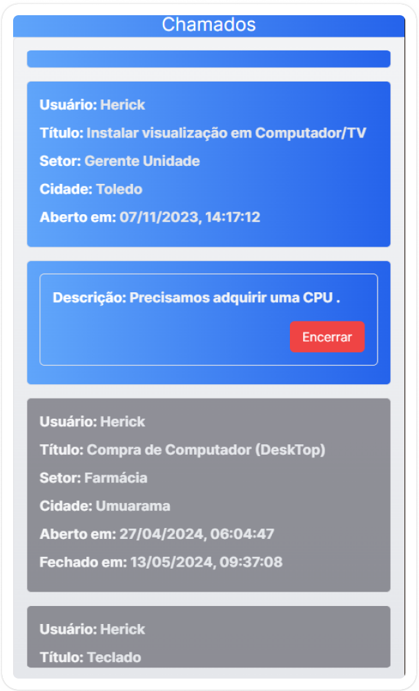

# Manutencao APP
front-end for manutencao API

# Run with pnpm
pnpm build

pnpm start

# develop with pnpm
pnpm dev

# Build with Docker
docker build -t manutencao_app -f Dockerfile . --no-cache

# Run with Docker
docker run -p 3006:3006 --name manutencao_app --restart always -d manutencao_app:latest